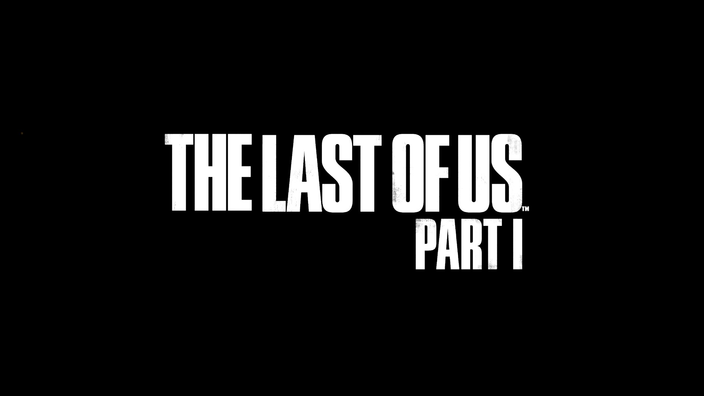
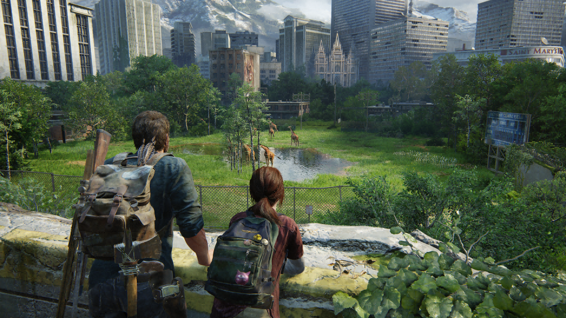

> 有一说一，XBOX手柄的截图，这是越来越捞了。。。以前还挺喜欢用的，然后就越来越卡。。。还不如Steam自带的截图，但是Steam截图质量又太差    难顶哦。。。



### 画面

顽皮狗的美术功底确实牛逼。

在看过游戏科学的访谈之后，就经常会关注游戏里的画面细节。比如说跳之类的动作，不管从哪个角度走过去都非常自然。

或者举一个常见的例子——推车，游戏里经常有需要移动物体来踮脚之类的操作，在其他 90% 以上的游戏里，你会发现车子绝对是只有 `x、y` 两个方向能够移动的；最后生还者似乎是第一个能全方向移动的，牛逼👍

整体的场景方面，其实有很多场景都是在黑黢黢的地方：房间、夜晚、下水道之类的，会感觉到非常压抑，但是每当从这类逼仄的空间出来后，顽皮狗的美术功底立刻就体现出来了，绝对的经验：





只能说在画面这方面，顽皮狗确实没得说 ...... 但是 PC 优化是什么辣鸡啊， 2060 全程中低画质 50帧都稳不住，一看到掉帧就知道有人来了 ... 后期甚至肉眼就能看到人脸上或者物体表面的贴图变化。可用点心吧 ......

不能稳60帧我只能说真的太坐牢了

### Gameplay

其实这方面我想说的还挺多的😵‍💫

虽然最后生还者1的评价一直是**神**，但是我对画面、剧情之下的玩法其实意见蛮大 ...（当然其实只能算这类游戏的通病，多少有点吹毛求疵了）

首先，毋庸置疑本作是一款以剧情为核心推动的游戏，但是 Gameplay 中的很多设定，却和剧情推动产生了矛盾。

由于资源的缺少，捡垃圾成了一种必然，但是在线性游戏中，又直接砍掉了跑步这个动作，这就导致了不得不慢吞吞的捡垃圾，哪怕是空房间，也要走过每一个角落。这就导致捡垃圾的环节占据了太多时间，甚至和主要的剧情五五开，狠狠的打破了剧情本身的节奏。

这就成了一个核心的冲突：剧情推动 -> 资源缺乏 -> 捡垃圾 -> 剧情割裂 ， 就类似于 JRPG 里的垃圾支线，这种冲突矛盾在找到汤米后达到了巅峰：

#### <font color="red"><b>剧透警告!!!</b></font>

```shell
在汤米处被袭击后
一方面，主角非常着急找到艾莉
另一方面又不得不在厂房里翻找资源以防错过
```

类似的还有：

#### <font color="red"><b>剧透警告!!!</b></font>

```shell
在雪地中乔尔醒来后
着急去找艾莉，另一边艾莉也快寄了(bushi)
但是却不得不四处捡垃圾防止错过资源
```

这种矛盾和冲突其实贯穿了游戏的始终，当然，如果说是为了更加真实不得不如此，那么当骑马去找艾莉时又应该怎么解释？

骑马的环节我觉得是整个游戏中做的最垃圾的部分，本来换了一个新的载具应该是完全不一样的游戏体验，**应当**能将整个游戏的氛围推向一个高潮，结果呢？

马的速度慢的一批，甚至我觉得这应该是正常游戏里人跑的速度，和当时紧张的氛围形成了巨大冲突，而且是完全没有意义的冲突。还有骑马过程中各种意义不明的建模，本来速度就已经很慢了，结果一碰到某些毫无意义的刚体，又 nm 更慢了。

本来应该是能让玩家肾上腺素飙升的一个环节，硬是做成了坐牢环节。。。

嗯，Gameplay 就说这么多吧，如果说捡垃圾导致的剧情割裂是通病的话，骑马这个我觉得就是纯纯没用心了。

### 剧情

剧情方面应该可以说是很棒，当然如果没有前面 Gameplay 的割裂，应该能够再上一个层次(

核心仍然是围绕着人性和成长，乔尔和艾莉之间的羁绊在这一趟的旅程中逐渐加深（这旅程不比FF15好得多）。

末世下的每一个选择，都是人性最后的光辉。
