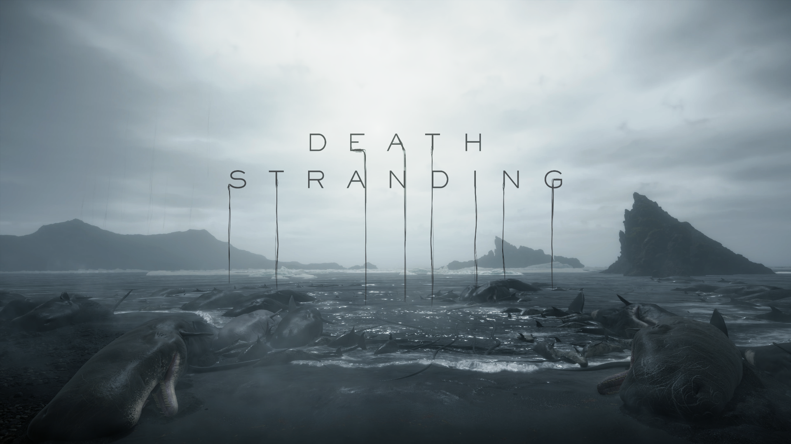
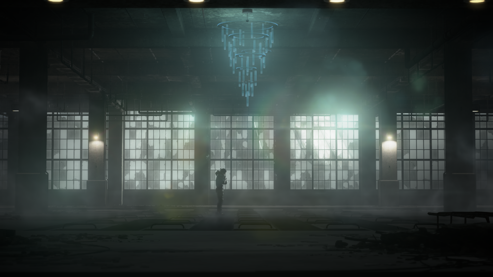
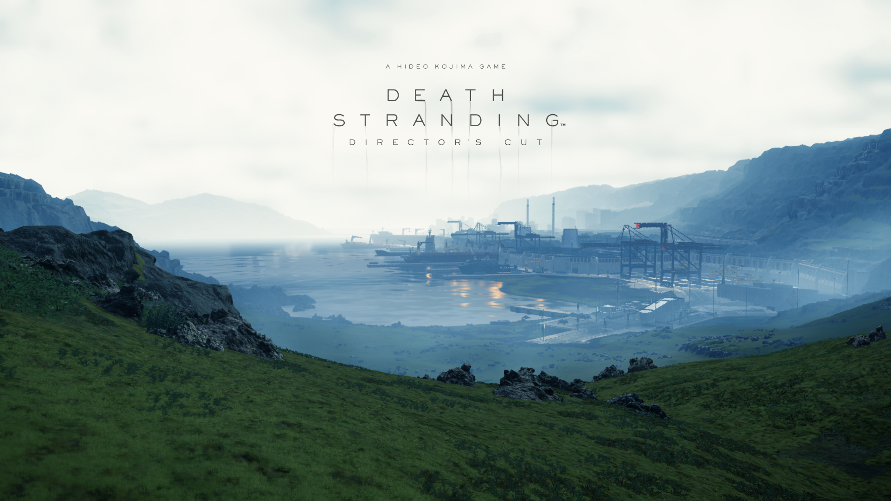
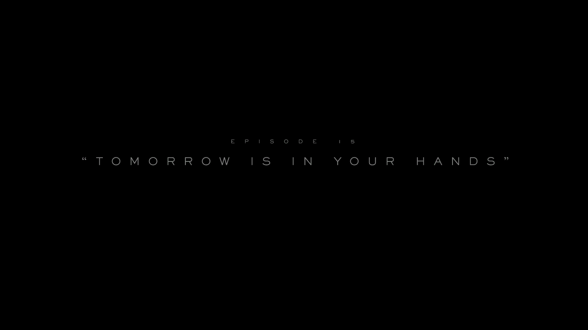

## 测评

### 画面

来自游骑兵工作室的引擎，画质已经达到了次世代游戏的天花板。

而和画质相得益彰的是小岛独特的审美，苍凉的冷色调，蓝色和灰色组成了这个近乎绝望的世界；而每次亚美莉出现时，一身艳红色长裙，似乎象征着生命的律动……

画质好的游戏很多，但是游戏的画面风格却全看制作人的功力，死亡搁浅仅就画风已足以被称之为艺术品。

### Gameplay

#### 战斗

手柄的枪械手感太怪了，而且很不舒服orz。几次进战场都不得不从手柄切换到键鼠，可以算是战斗系统里很大的一个问题吧。

#### 关卡

以“链接”为核心，送货的体验一级棒。但是载具的驾驶手感稀烂，真的稀烂，比上面的枪械手感差很多，尤其是在雪山地区，开车简直是一种折磨。

#### 核心

核心送货其实是比较慢热的体验，甚至可以说，送货其实是一个积累多巴胺的过程，翻山越岭到达终点后看到顾客的点赞，路途上时间雨、米尔人、BT所带来的折磨全都消失殆尽，积蓄的多巴胺在这一刻释放。

是一种和快餐式游戏截然相反的游戏体验。

### 音乐

神中神。

低吼乐队悠远的歌声，伴随着流水，世界在这一刻安静，空旷、辽阔，这是在游戏中听到音乐的第一感觉。音乐的出现经常是在时间雨，这一刻，眼前皆是风景。

### 剧情

环环相扣，每一个伏笔都在后文被解开。

以人名为章节名，死亡搁浅刻画出一个个栩栩如生的人物，亡人、心人、硬汉、玛玛、芙拉吉尔……npc不再是标签的堆砌，他们是山姆的好友，将他从幽闭的个人带向世界。

### 总评

曾经发生过一场爆炸，空间和时间自那一刻产生。
曾经发生过一场爆炸，有一颗星球在爆炸后诞生并旋转。
曾经发生过一场爆炸，生命在爆炸后繁衍下来。
曾经发生过一场爆炸，那是人类经历的最后一次爆炸了。

这就是艺术品。

## 随笔

游戏完了很久，六十多小时，基建导致的()

还记得第一个任务回首都节点城时，第一次经历过BT，在青色的草地上，Don't be so serious 响起，这个孤独的世界立刻让我投入其中。

很快，60h过去，仍然沉浸在结局震撼中的我，再次走上了那条路，BB‘s theme 响起，60个小时的陪伴，在这一刻画上句号。彩虹出现，世界终于还是没有走向终焉。

Tomorrow is in your hands

