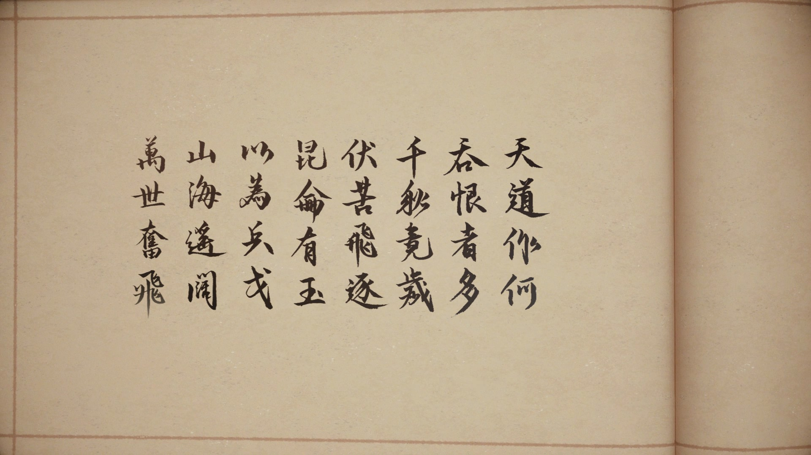

我无比相信，这就是黑神话之前**最好的国产单机游戏**。

## 测评

### 画面

虽然是来自不知名的古早引擎，但从画面而言，2018年的古剑3无疑已经站在了当时的世界一流水平。并且其独有的中式风格，绝对是给中国玩家的一封情书：鄢陵的遍地桃花，遥夜湾的鲛人泣珠，西陵的芦苇飘摇 . . . . . . 

### Gameplay

#### 战斗

战斗真是一言难尽了......耐力完全不够用，破空几乎成为了废物技能；按部就班的打只会毫无观赏性，动作僵硬，镜头混乱，打击感聊胜于无。

镜头这点真要点名骂了，烛龙自己不知道镜头调教成什么b样吗，还要搞那个飞天的怪？？？

虽然是arpg游戏，但不得不说，古剑3中act的部分着实很一般，只能算是二线末尾的水平。

#### 关卡

作为一个很线性的游戏，可以说古剑3的绝大多数关卡设计相当有水平，张弛有度。但是！跳跳乐是nm谁设计的，你的跳跃动作有多僵硬没数吗？

#### Others

##### 难度曲线

应该说，本作的难度曲线可以算相对平滑（你永远可以相信cn的数值策划），除了中间突然冒出来的大天魔......

##### 系统

家园系统......网游后遗症，并且不推家园会导致数值完全更不上，坏文明。RPG系统则相当平稳，你永远可以相信国内的数值策划

### 音乐

传统的中国音乐，和场景美术完美融合，结尾千秋曲响时，仿佛能看到悠悠千载

可以说在场景音乐方面已经达到了世界一流水平

### 剧情

#### 人设

可以说，本作中的每一个角色都足够丰满。不只是主角，反派，甚至配角都能跃然纸上，几乎所有有剧情戏份的角色都有人物弧，而不只是扁平化的设定。

并且，有人物弧的角色可以说是远超了尼尔机械纪元，作为RPG游戏已经是教科书的级别。

当然，吹毛求疵的话，其实姬轩辕的流程安排存在一些小问题：所有的侧面烘托都已经将这个角色推到了极致，但是最直接的一次正面叙事却反而是姬轩辕人生中最大的失败，难免会对前面的侧面烘托产生一些质疑。如果能把这点处理好，本作的人设堪称无暇。

#### 节奏

在前面关卡部分其实说了，**张弛有度**。

在老的国产RPG游戏里，其实仍然是剧情占很重的地位，以类似小说的形式展开。这必然会导致节奏冗长，古剑三很好的砍掉了一些非必要部分，让主线支线能很好地展开。（除了傻逼跳跳乐）

当然，节奏方面的另一个问题就是结尾太过仓促，虽然是资金不足导致，但仍然不得不提。西陵本身的优化就已经是一坨了，最后挖的几个坑也没填上：蚩尤部落和仙族草草展开又草草收尾。当然可以理解是为dlc和续作做准备，但确实为原来完整的剧情填了一些遗憾。

#### 立意

立意已经是在我玩过的所有游戏中最高的一级了，千载传承，贯穿古今。

在所有游戏中，大概也只有尼尔机械纪元可与之媲美。

#### 剧情

剧情安排**妙到毫颠**！

北洛的身世逐步展开、人族辟邪族双线推进，

巫炤暗线隐匿、千年前纠纷浮出水面，

北洛云无月自然而然的感情，

岑缨葛先生师徒相传

所有剧情线网状推进，彼此影响交织却又不混乱，可以说是玩过剧情推进最好的游戏。

#### 总评

抛开情怀有80分，加上情怀85分的作品。

如果说黑神话将大多数方面都打磨到了八九十分，少数的几项达到了十分；那么古剑3就是剧情达到了11分，有几项90分，几项80分，还有一堆六七十分的设计。

但即便如此，它仍然是黑神话之前最好的国产单机游戏。

## 叭叭

> 天道作何，吞恨者多。
> 千秋竟岁，伏苦飞逐。
> 昆仑有玉，以为兵戈。
> 山遥海阔，万世奋飞。

千秋曲响，画卷缓缓摊开，直到最后一页，32字结尾诗，曲终

带给我的，却是长久的震撼。

我不知道海外玩家是否能够明白这个游戏的主题，但其千秋传承，却必然是刻印在每一个中国玩家的内心深处。

姬轩辕、嫘祖，一个个熟悉的名字在游戏中出现，一幅千载蓝图在眼前展开，曾经的喧闹与宁静尽在其中。无数次的分崩离析，无数次的流离失所，但终有一个纽带在所有人心里，他叫轩辕，叫有熊。

然而，古剑3的立意却不止于轩辕丘，而更是扩展到人族

> 一族事，一族断，仰人鼻息，朝夕可亡

其内迸发而出的生命与昂扬，或许也正是这个时代所欠缺的。

2018年，很难想象为什么烛龙会在那一年发布古剑3

当时的国产单机时长一片惨淡，古剑3也只是堪堪回本

我不知道结尾时小缨子那句“总有人，会和我们一起的”是否还有别的含义，但是，大概是有的吧——那一年，失落之魂加入索尼中国之星计划，黑神话悟空立项 可以说是真正意义上的国产单机萌芽的一年

这就是古剑三，生不逢时，却是国产单机黎明前的曙光

> 愿我人族，于此魂梦江海、万古河山之间，星火世传，奋飞不辍！

