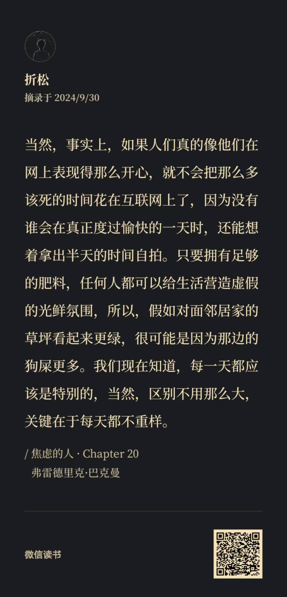

#### 读书笔记？

简单放几张摘录的截图吧，更多的内容可能放在后面的杂谈里再说~

#### 杂谈

会想起曾经刷到过的一个视频，所谓的“**做自己**”，究竟怎样才是做自己？

是完完全全从自己的需求出发，再去考虑所有事情吗，这种普世所认可的做自己，又和所谓的 “*精致的利己主义者*” 有何不同

我，自己，究竟是一个怎样的概念？淡漠的是我，沉迷的是我，热爱的是我，疯狂的也是我 . . . . . . 我想，我应当是我所经历，我所见闻的集合；集合内有矛盾也有冲突，沉默的、聒噪的，哪个才是真实的？其实都是。

回到正题，当我下意识去考虑别人的需求想法的时候，这就不是做我自己了吗？事实是，这种考虑本就是出于我的内心想法——考虑他人和精致利己，统一融合而成了这一个“我”。

大概是这样吧

高中时曾经一度痴迷于为自己人格分类，甚至给自己做了很多总结，我在表层是个享乐主义者但底层是悲情的浪漫主义者。如果让现在的我看到了，大抵会评论一句，***放屁***

> 德克萨斯州的飓风，溯其源头，或许只是南美洲蝴蝶的轻舞
>
> 但飓风成型中的每一步，都不止与蝴蝶相关

