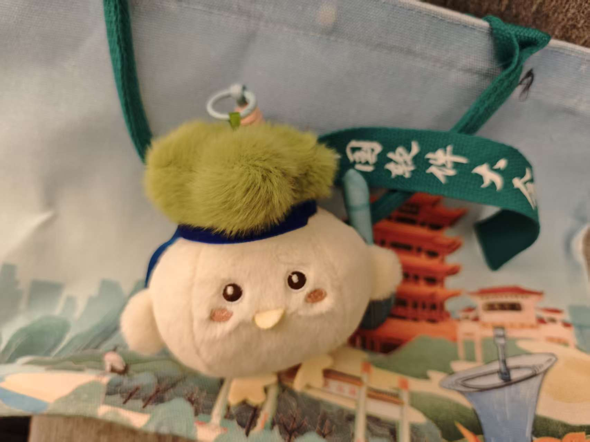

# 武汉

> Note: 缺席的记录留给年终总结。

------
> 实验室配的Mac的意义就是——在机场线打工，在登机口打工，在行李转盘还在打工，我就是他妈的打工皇帝

------

武汉，比起杭州少了几分脂粉富贵，多了一点江湖烟火

软件大会发的蒜鸟，手上拿着越王勾践剑，捏一下就会大喊“蒜鸟蒜鸟，屁大点事捏”

怪可爱的

拎着这只聒噪的鸟，我还是习惯性地走向了水边
记忆里我总是这样，沿着海岸线，沿着海河，沿着苏堤白堤静静地走

汉口江滩的阴影把人藏得很好。 我就这么走着，看座座大桥跨江而行，直到双腿泛起酸疼，看着江水奔流，突然想起，这里是某位同学的家乡

念及“君住长江头”，我本以为黄鹤楼能与记忆里的北固楼遥相呼应，再续一段古意

但这它终究让人落了空，
那份“直下看山河”的险势不再，李白诗里“惟见长江天际流”的孤寂，也被周围的喧嚣冲散

鹦鹉洲早已消失在历史的尘埃中，好在对岸鳞次栉比的高楼成了新的“历历汉阳树”，灯光璀璨的鹦鹉洲大桥，似乎凭吊着那位年轻的诗人

甚至连路牌上指引的梅花轩也没能找到
或许它也像多景楼一样，隐没在北固楼庞大的阴影之中
既然笛声已歇，大概也不会有人再听闻那一曲《梅花落》了吧 

下了黄鹤楼，顺着中华路漫无目的地走。
身侧是滚滚东逝水

或许，我在此地放下的一只纸船，
**6.56天后**
**也能到江南**

